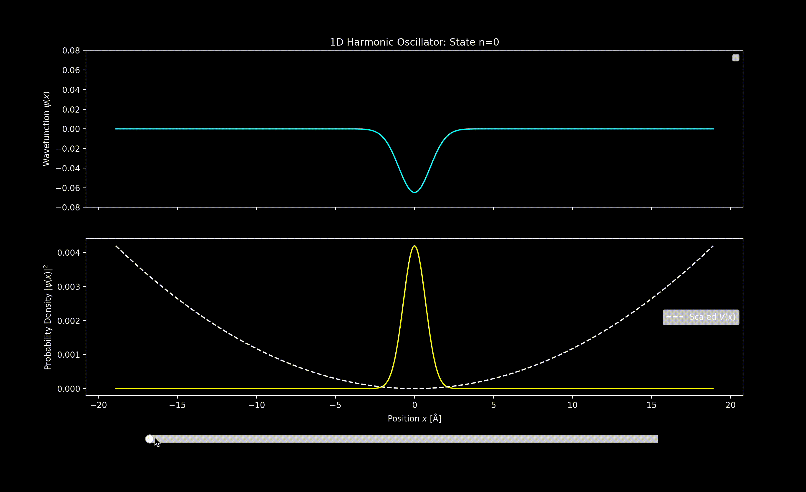
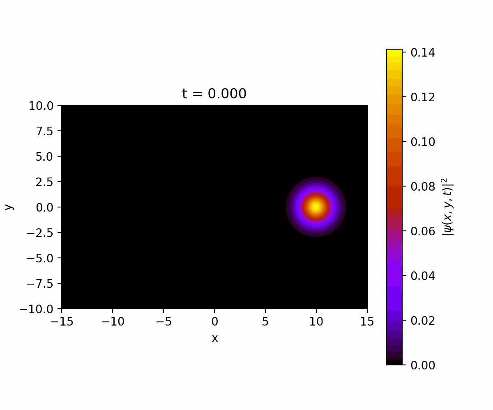
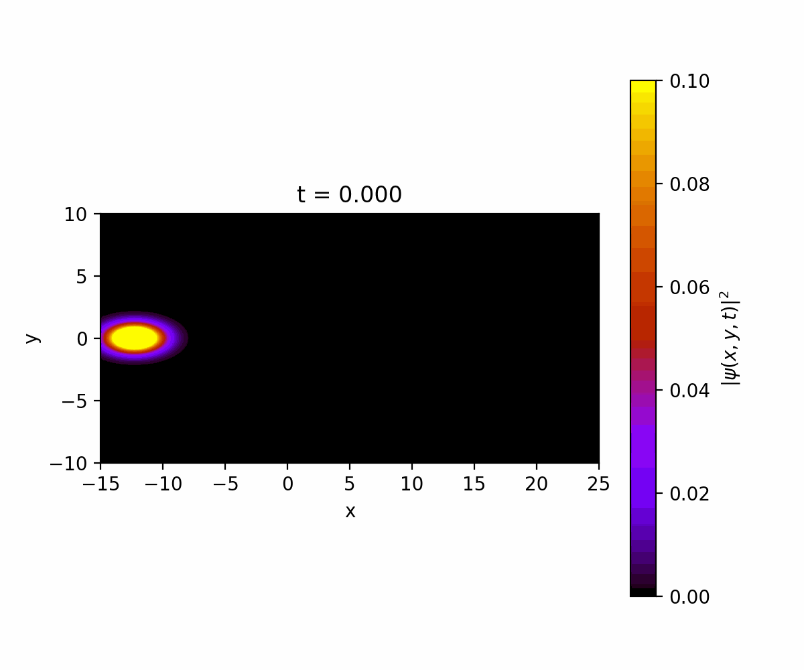
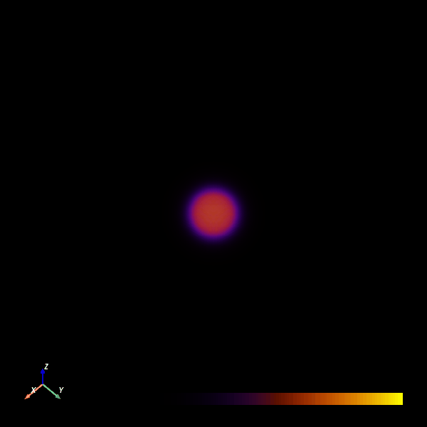

# Schrödinger Equation Solver

This project aims to solve the time independent and time dependent Schrödinger equation in 1D, 2D, and 3D under any interaction potential. This solver seeks to provide an easy to use and scientifically accurate solver. 

## Installation 
Clone this repository and install dependencies:
```
git clone https://github.com/Nakulsuthar/Schrödinger-Equation-Solver.git
cd Schrödinger Equation Solver
pip install -r requirements.txt
```

## How it works
### Time Independent Schrödinger Equation (TISE)

=\left[-\frac{\hbar^2}{2m}\nabla^2+V(\mathbf{r})\right]\psi(\mathbf{r}))

The Time Independent Schrödinger Equation Solver works by building the hamiltonian
on a discrete grid using sparse matrices: the kinetic term from finite-difference Laplacians, and the potential from user-defined functions. It then uses efficient eigensolvers from scipy library to compute energies and wavefunctions, making it possible to simulate a wide range of quantum systems in 1D, 2D, and 3D.

For example:
``` H = hamiltonian(N=5120, extent=20*Å, mass=1.0, spatial_ndim=1, potential=Harmonic_Oscillator, potential_type="grid")``` 

is called under a given interaction potential (Harmonic Oscillator) and then ```H.solve(states=n) ``` function is called to find the first n eigenstates. This function not only returns the eigenstates but also finds the eigenvalues which is the energies of the system at a given state. 

### Time Dependent Schrödinger Equation (TDSE)

=\left[-\frac{\hbar^2}{2m}\nabla^2+V(\mathbf{r})\right]\psi(\mathbf{r},t)) 

The Time Dependent Schrödinger Equation is solved using the Crank-Nicelson method. The Crank-Nicolsen method is used for when the solver is dealing with 1D and 2D. This method works by using the implicit and explicit finite-difference methods, making it unconditionally stable. It works by averaging the Hamiltonian’s action between the current and next time steps, leading to a linear system of equations that preserves the wavefunction’s norm and gives accurate time evolution.


## Examples
### 1D Eigenstates 
Below are the working examples of both TISE and TDSE solver in action under a 1, 2, and 3 dimensions.
<table>
  <tr>
    <td align="center" width="50%">
      <br>
      <code>1D_harmonic_oscillator_TiSE.py</code><br>
      <a href="Potentials/1D_harmonic_oscillator_TISE.py">🔗 Link to the example</a>
    </td>
    <td align="center" width="50%">
      <br>
      <code>1D_harmonic_oscillator_TDSE.py</code><br>
      <a href="Potentials/1D_harmonic_oscillator_TDSE.py">🔗 Link to the example</a>
    </td>
  </tr>
</table>


This is the most common hamiltonian under the quantum harmonic oscillator as mentioned above. The first script shows the first 30 eigenstates of the hamiltonian under a harmonic oscillator. The interaction slider can help view different states. The lower plot on the first script shows the corresponding probability density of finding a particle in that region. The second script uses the exact same hamiltonian but instead it uses the crank-nicelson method to plot all of the eigenstates together known to be a moving guassian packet.

### 1D Quantum Tunnelling

<div align="center">

  <br>
  <code>python 1D_tunnelling_TDSE.py</code><br>
  <a href="Potentials/1D_tunnelling_TDSE.py">🔗 Link to the example</a>

</div>

This script demonstrates the effect of quantum resonant tunnelling where the same moving guassian packet from above is placed under a new potential which is a infinitely long energy barrier placed between``` -1 <x <1 ```. As seen in the script, some parts of the wave packet is transmitted despite having less energy than the energy barrier. This happens because the wavefunction does not vanish abruptly at the barrier but decays exponentially inside it, leaving a finite probability of re-emerging on the other side. Unlike classical particles, quantum states are described by probability amplitudes, which allow partial transmission even when the energy is below the barrier height.

### 2D Sinai billiard and Top hat Potentials
<table>
  <tr>
    <td align="center" width="50%">
      <br>
      <code>2D_sinai_billiards_TDSE.py</code><br>
      <a href="Potentials/2D_sinai_billiards_TDSE.py">🔗 Link to the example</a>
    </td>
    <td align="center" width="50%">
      <br>
      <code>2D_different_potential_TDSE.py</code><br>
      <a href="Potentials/2D_different_potential_TDSE.py">🔗 Link to the example</a>
    </td>
  </tr>
</table>

This solver is able to solve beyond 1 dimension hamiltonians. The first script here shows a 2D wave packet moving in a square box with an impenetrable circular obstacle at the center which creates chaotic scattering and complex interference patterns. The second script shows an even more complex potential called the mexican top hat which is a radially symmetric shaped like a ring valley. 

### 2D Double slit experiment 

<div align="center">

  <br>
  <code>python 2D_double_slits_TDSE.py</code><br>
  <a href="Potentials/2D_double_slits_TDSE.py">🔗 Link to the example</a>

</div>

Perhaps one of the most famous experiments in physics which this script is able to solve. The experiment shows the wave like behaviour of a particle. This script has a long barrier with 2 narrow slits carved in it to allow the wave like diffraction and interference pattern.

### 2D Electric Field 

<div align="center">

  <br>
  <code>python 2D_electric_field_TDSE.py</code><br>
  <a href="Potentials/2D_electric_field_TDSE.py">🔗 Link to the example</a>

</div>

This is also one of the potentials that can be added in this solver. The potential is just a electric field and using electromagentism, the result would be a cylotron orbit. Instead of having a single guassian packet, users can also add another guassian packet creating what is called a superposition of two wave packets. 

### 3D Eigenstates
<div align="center">

  <br>
  <code>python 3D_eigenstates_TISE.py</code><br>
  <a href="Potentials/3D_eigenstates_TISE.py">🔗 Link to the example</a>

</div>
This example here shows how to use the 3D solver which is used under the split step method instead of crank-nicelson method which was used for 1D and 2D solver. Below are two more examples of how the 3D solver is used. 

<table>
  <tr>
    <td align="center" width="50%">
      <br>
      <code>3D_Potentials_TISE.py</code><br>
      <a href="Potentials/3D_Potentials_TISE.py">🔗 Link to the example</a>
    </td>
    <td align="center" width="50%">
      <br>
      <code>3D_Potentials_TISE.py</code><br>
      <a href="Potentials/3D_Potentials_TISE.py">🔗 Link to the example</a>
    </td>
  </tr>
</table>


## License
This project is licensed under the MIT License.
## Author
Made by [Nakul Suthar](https://github.com/Nakulsuthar)


